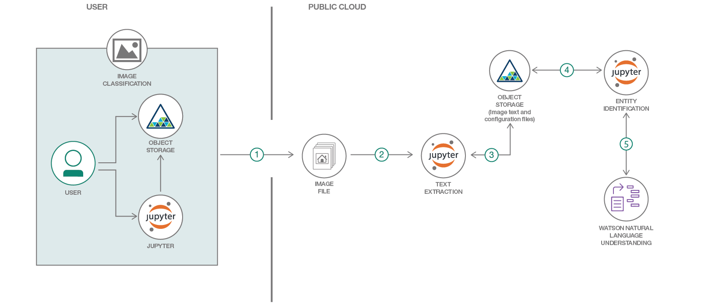
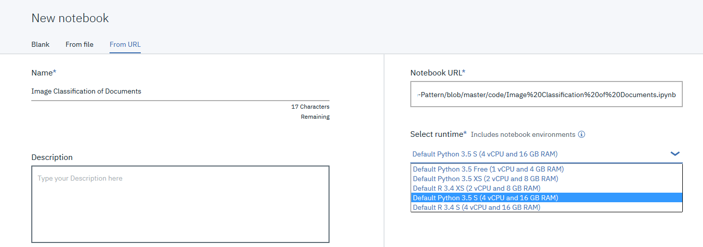
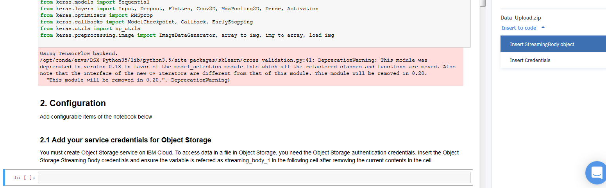
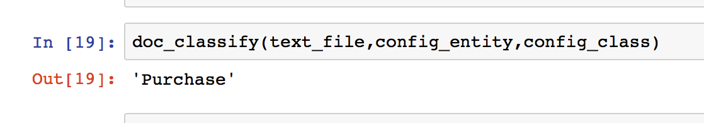

# Image Recognition and Information Extraction from Image Documents using Keras and Watson NLU  

Many organisations process application forms, such as loan applications, from it's customers. Along with the application forms, customers provide other documents needed for processing applications. These additional documents are such are identity proof document, address proof document. Generally these application forms, along with supporting documents, are scanned and captured into the organisation's systems for further processing of applications. Processing these documents and identifying relevant information from documents can be extremely cumbersome and require high manual intervention. Most of the information is captured in application form document. Current process involves a human to identify type application form, read through application forms and identify specific information from application forms. This code pattern shows how such processes can leverage Machine Learning, Natural Language Processing and Natural Language Understanding services and automate identifying relevant information from images.

This code pattern covers the following aspects:
* Classify images so as to separate out the application form document
* Extract text from the application form document
* Identify specific information from application form documents

After completing this pattern, you will learn how to:

* Perform Image Recognition using python libraries such as scikit-learn and keras(deep learning libraries)
* Extract information using Optical Character Recognition
* Use the IBM Watson NLU API to extract metadata from documents in Jupyter notebooks.
* Use a configuration file to build configurable and layered classification grammar.
* Use the combination of grammatical classification and regex patterns from a configuration file to extract information.

In this code pattern, we have considered applications for `Purchase Agreement` and `Rental Agreement`. Typical documents that are submitted for these applications are PAN (Permanent Account Number) card, Driving License, Cheque leaf, Passport and the application form itself. This code pattern identifies the application form document from all the other application documents. Text is extracted from the image of application form document. From the text thus extracted, information, relevant to the type of application, is identified using Watson's natural language processing capabilities. What information to identify from what type of document is guided by configuration files.

We will use Python, Jupyter notebook, SK-Learn and Keras libraries, Watson Natural Language Understanding service and IBM Cloud Object Storage


## Flow

1. User provides a set of images for classification to a trained machine learning model
2. Classified image files are stored in Object Storage
3. User runs Jupyter notebook for text extraction, by providing the form document image
4. Extracted text from form document image is stored in Object Storage as text files
5. User runs notebook for entity extraction
6. Pull the text files from Object storage
7. Pass the text to NLU to extract entities


## Included components

* [IBM Watson Studio](https://console.bluemix.net/catalog/services/watson-studio): Analyze data using RStudio, Jupyter, and Python in a configured, collaborative environment that includes IBM value-adds, such as managed Spark.

* [IBM Cloud Object Storage](https://console.bluemix.net/catalog/infrastructure/cloud-object-storage): An IBM Cloud service that provides an unstructured cloud data store to build and deliver cost effective apps and services with high reliability and fast speed to market.

* [Watson Natural Language Understanding](https://console.bluemix.net/catalog/services/natural-language-understanding/?cm_sp=dw-bluemix-_-code-_-devcenter): A IBM Cloud service that can analyze text to extract meta-data from content such as concepts, entities, keywords, categories, sentiment, emotion, relations, semantic roles, using natural language understanding.


## Featured technologies

* [Jupyter Notebooks](http://jupyter.org/): An open-source web application that allows you to create and share documents that contain live code, equations, visualizations and explanatory text.
* [Artificial Intelligence](https://www.computerworld.com/article/2906336/emerging-technology/what-is-artificial-intelligence.html): Intelligence demonstrated by machines, in contrast to the natural intelligence displayed by humans.
* [Machine Learning](https://searchenterpriseai.techtarget.com/definition/machine-learning-ML): Uses statistical techniques to give computer systems the ability to "learn" with data
* [Natural Language Processing](https://machinelearningmastery.com/natural-language-processing/): the ability of a computer program to understand human language as it is spoken. NLP is a component of Artificial Intelligence
* [Python](https://www.python.org/): An interpreted high-level programming language for general-purpose programming


# Steps
Follow these steps to setup and run this developer journey. The steps are described in detail below.
1. [Sign up for IBM Watson Studio](#1-sign-up-for-ibm-watson-studio)
2. [Classification of image Documents](#2-classification-of-image-documents)
3. [Text Extraction Using Optical Character Recognition](#3-text-extraction-using-optical-character-recognition)
4. [Entity Extraction and Document Classification](#4-entity-extraction-and-document-classification)
5. [Analyze the Results](#5-analyze-the-results)


## 1. Sign up for IBM Watson Studio

If you have not already signed up for Watson Studio then you can sign up [here](https://console.bluemix.net/catalog/services/watson-studio). By signing up for IBM Watson Studio, two services will be created - ``Spark`` and ``ObjectStore`` in your IBM Cloud account.


## 2. Classification of image documents

### 2.1 Data preparation

Training a machine learning model requires a large number of documents and variety in them. While we have trained and tested the methodology followed in this code pattern which given pretty good accuracy (>85%) with a large dataset, we cannot provide those images since they are not open images. For the sake of executing this code pattern and understanding the methodology we have provided one of our personal documents and masked personal information on those documents. Please note that multiple copies, with resolution and color changes, of same kind of documents are provided. It is recommended that the user create their own set of images and use them in this code pattern so that they can see real benefits of this code pattern.

To create your own dataset, follow the following naming structure for each type of image -


You can use the dataset provided in this code pattern or create your own dataset. To use the dataset provided in this code pattern, download the ``Data.zip`` file from Data folder of [this repository](https://github.com/IBM/image-recognition-and-information-extraction-from-image-documents)

#### To create your own dataset
Create three folders named `Train_Data`, `Test_Data`, `Val_Data` which are used for training, testing and validation respectively. Since we have used Cheque, Form Documents, Driving License, Pancard and Passport create folders to indicate the types of documents `Cheque`,`Documents`,`Driving_License`,`Pancard`,`Passport` which will be the classes that machine learning model learns and classifies images.

Compress the `Data` folder so it can be uploaded to Object Storage.

If you are using mac, the compression creates some additional files which should be deleted. On command prompt, go to the compressed file location and run the following commands:
```
* zip -d Data.zip \__MACOSX/\\*
* zip -d Data.zip \\\*/.DS_Store
```
### Test images for classification

Towards the end of the notebook, we need to provide test images which should be classified by the notebook after training is done. Place all images that need to be classified have to be in a folder. It's named as `testdoc-external.zip` in this code pattern. You can supply your own set of images for classification or use the one provided in this code pattern.

If you are using mac, the compression creates some additional files which should be deleted. On command prompt, go to the compressed file location and run the following commands.

For MACOSX use the following commands to remove the redundant folders/files created:
```
* zip -d test_doc-external.zip \__MACOSX/\\*
* zip -d test_doc-external.zip \\\*/.DS_Store
```

### 2.4 Create Object Storage service instance
[Create an Object Storage instance](https://console.bluemix.net/catalog/services/cloud-object-storage), if you do not have an instance created earlier.

### 2.4 Create notebook

A [notebook](https://datascience.ibm.com/docs/content/analyze-data/notebooks-parent.html) in Watson Studio is a web-based environment for interactive computing. You can run small pieces of code that process your data, and you can immediately view the results of your computation.

Login to [IBM Cloud Dashboard](http://console.bluemix.net/). Click on the Watson Studio instance that was created earlier. Click `Get Started` button at the bottom of the page.

* If a project is not created earlier then click `New Project`. Provide any Name. Object Storage instance should already be selected by default. Verify it is the instance that you want to use. If not select the instance you want from drop down list
* Click on `Assets` tab. Navigate to `Notebooks` section below. Click `Create Notebook`
* Select the `From URL` tab.
* Enter a name for the notebook.
* Optionally, enter a description for the notebook.
* Enter this Notebook URL: https://github.com/IBM/image-recognition-and-information-extraction-from-image-documents/blob/master/notebooks/Image%20Classification%20of%20Documents.ipynb
* Under Runtime select Default Python with 4 CPU and 16GB RAM
* Click the `Create` button.



### 2.5 Add data files

* Add the data zip file created/downloaded in [this section](#21-data-preparation) to Object Storage. In Watson Studio, go to your project default page, use `Find and Add Data` (look for the 10/01 icon) and its `Files` tab
* Click browse and upload `Data.zip` file


Repeat above step for test images `testdoc-external.zip` file.

Note:  It is possible to use your own data files. If you use an image file from your computer, make sure to conform to the directory structure mentioned above and zip it.

If you use your own data and configuration files, you will need to update the variables/folder names that refer to the data files in the Jupyter Notebook.

To open the notebook, click on the edit icon to start editing the notebook on your project.

In the notebook, update the global variables in the cell following

2.2 Global Variables section.

In the notebook, update the global variables in the cell following 2.2 Global Variables section.
Enter the desired batch_sizes for your training, validation and testing datasets

`intereseted_folder='Documents'` is used to specify which class is to be treated as application forms class, so that it points out images that belong to this class.


### 2.6 Update notebook with service credentials

Add the Object Storage credentials to the notebook

Select the cell below 2.1 Add your service credentials for Object Storage section in the notebook to update the credentials for Object Store.

* Delete the contents of the cell
* Use `Find and Add Data` (look for the 10/01 icon) and its Files tab. You should see the file names uploaded earlier. Make sure your active cell is the empty one below 2.2 Add...
* Under Files, click the dropdown for `Insert to code` for `Data.zip`
* Click `Insert StreamingBody object`.

* Make sure the credentials are saved as streaming_body_1. If not edit and replace the numbers to 1. There should be four such occurrences in the cell as shown in the below image


Select the cell in Section 4.4

* Delete the contents of the cell
* Use `Find and Add Data` (look for the 10/01 icon) and its Files tab. You should see the file names uploaded earlier. Make sure your active cell is the empty one below 2.2 Add...
* Under Files, click the dropdown for `Insert to code` for `test_doc-external.zip`
* Click `Insert StreamingBody object`.
* Make sure the credentials are saved as streaming_body_2. If not edit and replace the numbers to 2. There should be four such occurrences in the cell as shown in below image


Run the notebook by clicking on `Cell`>`Run all` in the menu bar.

Depending on the dataset, the training of the model takes about one hour. When all the cells in the notebook have run without any errors, we have our machine learning model trained. The trained model also classifies test images. It will point out to the test image that was of the type `Document` (application form document)


This notebook was able to identify the form document from a set of application documents.

## 3. Text Extraction Using Optical Character Recognition

[Previous section](#2-classification-of-image-documents) identified application form document among the list of all image documents. This section extracts text from the application form document that was identified in the above section. The text is then saved as text document on to Object Storage.

We will use tesseract OCR for text extraction. We need to install tesseract engine on our local machine. And so we will run the next notebook on local.  
* [Install Tesseract OCR](https://github.com/tesseract-ocr/tesseract/wiki). Follow the instructions according to your system specifications
* To run the notebook locally, we will install Jupyter notebook on local. Refer [this link](http://jupyter.readthedocs.io/en/latest/install.html) for Jupyter installation instructions
* Download `Convert_Image_to_Text.ipynb` from repo https://github.com/IBM/image-recognition-and-information-extraction-from-image-documents/blob/master/notebooks/ and open it in Jupyter notebook on local machine
* Under section 2.1, update the path of the form document. The form document was identified by the previous notebook run.


Create a file named `credentials.json` and save it anywhere on local machine, say on desktop. This will be a placeholder for cloud object storage bucket credentials. To get the credentials, go to your Cloud Object Storage instance and click on `Service Credentials`. In the desired bucket relevant to your project on Watson Studio, click on `View Credentials`


Click on `Copy to Clipboard` icon on the right to copy credentials. Paste the contents in `credentials.json` file.

Update the path of `credentials.json` file in `2.2 Connect to Object Storage` of notebook

Run the notebook by clicking on `Cell`>`Run all` in the menu bar.

* The output of this section will be the extracted text, which will be saved to Object Storage as `form-doc-x.txt`, where x is the nth form document. e,g, if it's first form document the file is stored as `form-doc-1.txt`. This file will be used later by another notebook to extract information from text extracted.


## 4. Entity Extraction and Document Classification

### 4.1 Create IBM Cloud services

Create the following IBM Cloud service and give a unique name for the service:

* [Watson Natural Language Understanding](https://console.bluemix.net/catalog/services/natural-language-understanding)


### 4.2 Create notebook

Login to [IBM Cloud Dashboard](http://console.bluemix.net/). Click on the Watson Studio instance that was created earlier. Click `Get Started` button at the bottom of the page.

* Under `Projects`, select the project
* Click on `Assets` tab. Navigate to `Notebooks` section below. Click `Create Notebook`
* Select the `From URL` tab.
* Enter a name for the notebook.
* Optionally, enter a description for the notebook.
* Enter this Notebook URL: https://github.com/IBM/image-recognition-and-information-extraction-from-image-documents/blob/master/notebooks/Entity%20Extraction%20and%20Document%20Classification.ipynb
* Under Runtime select Default Python with 1 CPU and 4GB RAM
* Click the `Create` button.


### 4.3 Upload text data and configuration data to Object Storage

There are two configuration files

#### 4.3.1 Entities Config
Check the file https://github.com/IBM/image-recognition-and-information-extraction-from-image-documents/blob/master/Configuration/config_entity_extract.txt. This file contains regular expressions and chunking patterns which are used to identify entities and their values from the text of the form document.
The configuration json controls the way the text is classified. The classification process is divided into stages - Base Tagging and Domain Tagging. The Base Tagging stage can be used to specify keywords based classification, regular expression based classification, and tagging based on chunking expressions. The Domain Tagging stage can be used to specify classification that is specific to the domain, in order to augment the results from Watson Natural Language.

#### 4.3.2 Document Type config
Check the file https://github.com/IBM/image-recognition-and-information-extraction-from-image-documents/blob/master/Configuration/config_legaldocs.txt. This file contains information to identify the type of the document. It specifies what all entities should be available in a document to categorise the document to a particular type. E.g. A document can be a rental agreement document if it has entities `Leaser Term`, `Rent`, `Security Deposit`.

* Download `config_entity_extract.txt` and `config_legaldocs.txt` from the repo https://github.com/IBM/image-recognition-and-information-extraction-from-image-documents/tree/master/Configuration
* Add the above configuration files to Object Storage. In Watson Studio, go to your project default page, use `Find and Add Data` (look for the 10/01 icon) and its `Files` tab. Upload these files onto Cloud Storage using `browse` button


If you use your own data and configuration files, you will need to update the variables that refer to the data files in the Jupyter Notebook.

To open the notebook, click on the edit icon to start editing the notebook on your project.

In the notebook, update the global variables in the cell following

2.3 Global Variables section.

In the notebook, update the global variables in the cell following 2.2 Global Variables section.

Enter the filenames of the text file obtained as a result of `Text Extraction Using Optical Character Recognition` as well as the configuration files uploaded into Object Storage.


### 4.4 Create Watson Natural Language Understanding(NLU) service
Create [Watson NLU](https://console.bluemix.net/catalog/services/natural-language-understanding) service instance if not already available

#### 4.5 Add Watson NLU credentials to notebook
Get Watson NLU service credentials:
* On your IBM Cloud Dashboard, click on Watson NLU service instance. On the left hand navigation bar click `Service Credentials`
* If you see `View Credentials` under `Service Credentials` then click on the down arrow mark beside `View Credentials`. Make of note of the credentials.
* If you do not see `View Credentials`, then click `New Credential` to create new credentials and make a note of new credentials.

Select the cell below `2.1 Add your service credentials from IBM Cloud for the Watson services` section in the notebook to update `username` and `password` for Watson NLU.


#### 4.4.2 Add Object Storage credentials to notebook
* Select the cell below `2.2 Add your service credentials for Object Storage` section in the notebook to update the credentials for Object Store.
* Delete the contents of the cell
* Use `Find and Add Data` (look for the `10/01` icon) and its `Files` tab. You should see the file names uploaded earlier. Make sure your active cell is the empty one below `2.2 Add...`
* Select `Insert to code` (below your `sample_text.txt`).
* Click `Insert Crendentials` from drop down menu.
* Make sure the credentials are saved as `credentials_1`.


Run the notebook by clicking on `Cell`>`Run all` in the menu bar.

Entities identified from the form document are displayed as shown in below image


Document type identified is displayed as shown in below image


## 5. Analyze the Results

This pattern aims to automate the identification of legal form document from other such documents and further extract useful information to classify the kind of legal form document it is.

1. First, we ran the notebook `Image Classification of Documnet.ipynb`. Here we created and trained an image classification machine learning model. We then provided the model with a set of images for it to classify. The model classified the images and marked the application for documents in the set of input images by providing it's path. e.g. `test_doc-external/Form1 copy 2.jpg`
2. As a second step we ran the second notebook `conv_img_to_txt.ipynb` while providing the application form document identified by first notebook. Here we converted image to text using tesseract and uploaded the file to Object storage
3. As a final step we ran the notebook `Entity Extraction and Document Classification.ipynb`. This notebook used a couple of configuration files and identified required information from the text extracted in the second step above. It used Watson NLU and custom configuration to understand what information to identify based on what type of document is the text document. like, if the text is a purchase agreement, then it identifies a particular set of entities related to purchase agreement.
